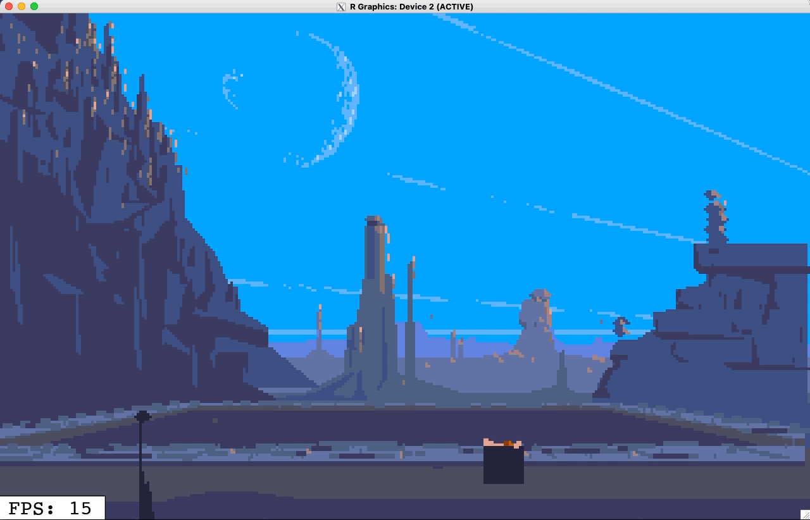

# The Polygons of Another World - Interactive Graphical Applications in R

This repository contains links and resources related to my talk at 
RStudioConf 2022.

This talk explores how to create fast interactive graphical applications using 
just R.

### Slides + Materials

* [PDF slides for talk](presentation-final.pdf) (exported from Keynote)
    * See the [`video`](video) directory in this repo for all the animations and videos 
      (which will obviously not show up in the PDF!)
* [View my Talk on RStudio Conf Schedule](https://rstudioconf2022.sched.com/event/11ibb)
* Original inspiration for this talk comes  [Fabien Sanglard's blog series](https://fabiensanglard.net/another_world_polygons/index.html) where 
they detail the struture of the game and how it was ported to different 
gaming platforms.

### Key packages

* [`{eventloop}`](https://github.com/coolbutuseless/eventloop) - provides 
  a friendly wrapper around the event-driven interactivity provided by
  R graphics devices.
    * See [online documentation](https://coolbutuseless.github.io/package/eventloop/index.html)
      to view rendered vignettes etc
* [`{nara}`](https://github.com/coolbutuseless/nara) - tools for
  fast manipulation of R's `nativeRaster` datastructure. 
    * See [online documentation](https://coolbutuseless.github.io/package/nara/index.html)
      to view rendered vignettes etc
  
  
### Game: AnotherWorld

* [`AnotherWorld`](https://github.com/coolbutuseless/anotherworld) - full code 
  AnotherWorld game written and playable in R. 
  
  
  
### Games: Pacman

* [`pacman`](https://github.com/coolbutuseless/pacman) - full R code for a 
  playable game based on Pacman.
  
  
  
  
## Limitation - WindowsOS

The WindowsOS version of R does not currently have support for the `onIdle` callback and 
therefore does not support  event-driven interactive graphics as implemented 
in the `{eventloop}` package.

**If you are a windows developor capable of adding support for an `onIdle` callback
to R itself, please get in touch!**

## Limitation - Flickering Cursor

The cursor icon in an `{eventloop}` window will flicker because of some hard-coded
behaviour in R's double-buffered `x11()` graphics device.

`{eventloop}` makes use of the `x11()` graphics device with a double-buffered
backend based on Cairo  (`x11(type = 'dbcairo')`).

The double-buffering within the graphics device is coordinated through use
of `dev.hold()` and `dev.flush()` calls.

Whenever `dev.hold()` is called, the cursor will be set to the busy cursor
(usually a stopwatch on macOS), and when `dev.flush()` is called the 
cursor reverts to a normal pointer arrow.

Since `dev.hold()` and `dev.flush()` are called when drawing every single 
frame, the cursor will flicker between these two images.

The interim solution is to not have the cursor over the window when interacting
with the app.  This only really works when the app solely relies on keyboard
feedback (like this pacman game).

The more complicated solution will involve crafting a patch to R itself to
make the cursor change behaviour user-configurable rather than hard-coded.

**If you are are an R developer capable of crafting such a patch to R ,
please get in touch with me!**
